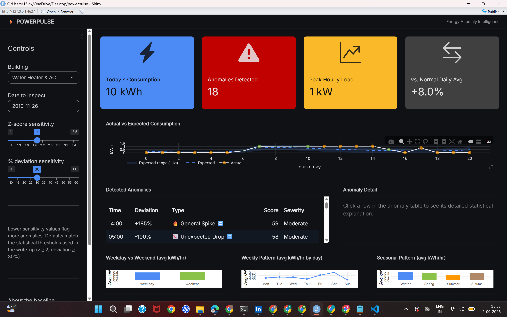
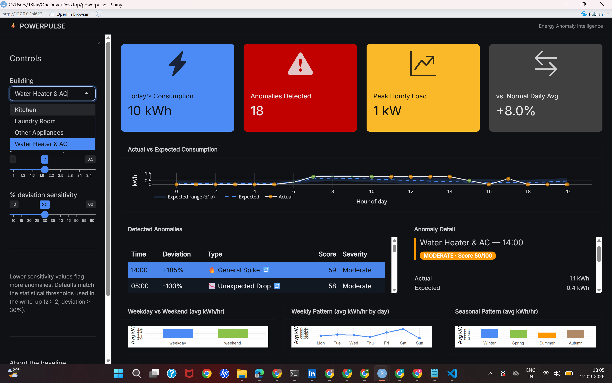

# ⚡ PowerPulse — Electricity Consumption Anomaly Intelligence

An R + Shiny app that doesn't just forecast electricity demand — it explains
**why** today's consumption looks abnormal, with a dynamic per-hour baseline,
statistical anomaly detection (z-score / IQR / % deviation), a 0–100 severity
score, and an interactive dashboard.

```
Energy Dataset → Data Cleaning → Consumption Profiling → Time-Series Analysis
→ Baseline Generation → Anomaly Detection → Statistical Explanation
→ Interactive Dashboard
```

## Screenshots

**Dashboard overview** — KPI cards, actual-vs-expected chart, and the
detected anomalies table for a real household circuit (Water Heater & AC,
from the UCI dataset above):



**Anomaly detail panel** — clicking a row surfaces the severity score and
the statistical "likely causes":



## Data source

This project is built and validated against **real electricity consumption
data** — the UCI Machine Learning Repository's
[Individual Household Electric Power Consumption](https://archive.ics.uci.edu/dataset/235/individual+household+electric+power+consumption)
dataset: one household's minute-level power readings from **December 2006 to
November 2010** (~2.07 million rows), including 3 sub-metered circuits
(kitchen, laundry room, water heater + AC).

`R/load_uci_data.R` converts that raw dataset into the hourly format
PowerPulse analyzes, treating each sub-metered circuit as a separate
"building" — so the anomaly detection in this repo runs on genuine
appliance-level electricity data, not synthetic/randomly generated numbers.
(`R/generate_data.R` also exists and can produce a synthetic dataset instead,
useful for quick demos or if you don't have the raw UCI file on hand — but
the primary, validated dataset for this project is the real UCI one above.)

The raw ~127 MB `household_power_consumption.txt` file itself isn't committed
to this repo (see `.gitignore`) since it's large, publicly available at the
link above, and fully reproducible from source — running
`source("R/load_uci_data.R")` regenerates `data/energy_data.csv` from it
in under a minute. What's committed instead is the code that proves exactly
how the real data was sourced and transformed.

## Project structure

```
powerpulse/
├── app.R                 # Shiny dashboard (UI + server)
├── R/
│   ├── generate_data.R   # creates a synthetic sample dataset (optional)
│   ├── load_uci_data.R   # converts the real UCI dataset into PowerPulse's format
│   └── pipeline.R        # cleaning, profiling, baseline, detection, scoring
├── data/
│   └── energy_data.csv   # the real, processed hourly dataset used by the app
└── README.md
```

## 1. Install R

If you don't already have it:
- **Windows/Mac:** download from https://cran.r-project.org
- Install **RStudio Desktop** too (free) — it's the easiest way to run this: https://posit.co/download/rstudio-desktop/

## 2. Install the required packages

Open R or RStudio and run:

```r
install.packages(c(
  "shiny", "bslib", "bsicons",
  "dplyr", "tidyr", "lubridate", "purrr", "stringr",
  "ggplot2", "plotly", "DT", "readr"
))
```

(One-time step — only needed the first time.)

## 3. Get the project onto your machine

Unzip `powerpulse.zip` anywhere, e.g. `~/Documents/powerpulse/`.

## 4. Run it

**Option A — RStudio (easiest):**
1. Open RStudio → File → Open Project (or just open the `powerpulse` folder).
2. Open `app.R`.
3. Click the **Run App** button in the top-right of the editor pane.

**Option B — plain R console:**
```r
setwd("path/to/powerpulse")   # the folder containing app.R
shiny::runApp()
```

**Option C — from a terminal:**
```bash
cd path/to/powerpulse
Rscript -e "shiny::runApp(port = 3838, host = '0.0.0.0')"
```
then open `http://localhost:3838` in your browser.

The first time you run it, if `data/energy_data.csv` doesn't exist, `app.R`
automatically falls back to `R/generate_data.R` to create a synthetic
90-day, 3-building demo dataset with built-in spikes, drops, and
night-time anomalies. **This repo already ships with `data/energy_data.csv`
pre-built from the real UCI dataset** (see "Data source" above), so on a
normal clone you'll be looking at real household data from the start —
the synthetic generator only kicks in if that file is missing or deleted.

## 5. Using your own data

Replace `data/energy_data.csv` with your own file that has these columns
(extra columns are fine, they're ignored):

| column            | type              | meaning                          |
|-------------------|-------------------|-----------------------------------|
| `building_id`     | text              | which building/meter this row is for |
| `timestamp`       | datetime (hourly) | e.g. `2026-06-01 08:00:00`        |
| `consumption_kwh` | number            | energy used in that hour, in kWh  |

Then just delete `data/energy_data.csv` and drop your file in with the same
name (or edit `DATA_PATH` at the top of `app.R`), and restart the app.

## 5b. Using the real UCI Household Power Consumption dataset

`R/load_uci_data.R` converts the classic UCI dataset
(https://archive.ics.uci.edu/dataset/235/individual+household+electric+power+consumption)
into PowerPulse's format automatically — no changes to `app.R` needed.

That dataset is one house with 3 sub-metered circuits (kitchen, laundry room,
water heater + AC), plus everything else. The script turns those 4 circuits
into 4 "buildings", so the app's per-building anomaly detection becomes real
per-circuit anomaly detection on ~4 years of real minute-level data.

1. Open the dataset page above, click **Download**, unzip it.
2. Move `household_power_consumption.txt` (~127 MB) into `powerpulse/data/`.
3. In R (working directory = the `powerpulse` folder):
   ```r
   install.packages("data.table")   # if you don't already have it
   source("R/load_uci_data.R")
   ```
4. This overwrites `data/energy_data.csv` with the real data. Just run the
   app as usual — the date picker and building dropdown update automatically.

It's ~2 million rows of raw minute-level data, so the conversion script can
take under a minute; the app itself works with the aggregated hourly data
(~35k rows/circuit), which loads quickly. If you want it to feel snappier
while exploring, there's a commented-out line near the bottom of the script
to keep only the most recent 12 months.

## 6. How the analytics work (`R/pipeline.R`)

1. **`clean_energy_data()`** — de-duplicates, coerces types, clips negative
   readings, linearly interpolates small gaps, and adds calendar features
   (hour, weekday/weekend, season, night-time flag).
2. **`profile_consumption()`** — hourly/daily/weekly aggregates, peak hours
   (top quartile of average hourly load, computed per building from its own
   data — not a hardcoded clock-time guess), weekday-vs-weekend and seasonal
   averages.
3. **`build_baseline()`** — the *dynamic baseline*. For every
   `(building, hour-of-day, weekday/weekend)` combination it computes a
   leave-one-day-out expected mean and standard deviation, so "Monday 8 AM"
   and "Saturday 8 AM" get genuinely different expectations instead of one
   global cutoff. It also computes each building's actual peak hours and
   its overall average consumption, both used by detection below.
4. **`detect_anomalies()`** — flags a reading as anomalous if **any** of:
   - `|z-score| ≥ threshold` (default 2)
   - outside the Tukey IQR fence (`Q1 - 1.5×IQR`, `Q3 + 1.5×IQR`)
   - `|% deviation from expected| ≥ threshold` (default 30%) — but **only**
     when that hour's own baseline isn't near-zero relative to the
     building's overall scale. This matters a lot on real appliance-level
     data: a "kitchen" circuit that's usually ~0 kWh will show a "+400%"
     swing from any routine use, which isn't a meaningful anomaly. z-score
     and IQR don't have this problem (they're normalized by that hour's own
     standard deviation), so they stay fully active even on bursty,
     near-zero circuits — only the raw % check gets this extra guard.

   Also detects **repeated abnormal patterns** (same hour anomalous in ≥2 of
   the last 3 same-day-type occurrences) and classifies each anomaly into
   `morning_spike`, `night_spike`, `peak_load_spike` (using each building's
   actual profiled peak hours), `unexpected_drop`, `weekend_anomaly`, or
   `general_spike`.
5. **`score_severity()`** — a 0–100 score blending z-score magnitude (50%
   weight), % deviation (30%), plus bonus weight for night-time and repeated
   anomalies (10% each), bucketed into:
   - `0–20` Normal · `21–40` Low · `41–70` Moderate · `71–100` Critical
6. **`explain_anomaly()`** — turns one scored row into plain-English "likely
   causes" bullets: morning spike, weekend baseline exceeded, peak-load
   window exceeded, night-time anomaly, unexpected drop, repeated pattern,
   and a σ-based statistical description. The peak-load and load-related
   bullets are **circuit-aware** — they say "kitchen appliance load,"
   "laundry appliance load," or "water-heater / HVAC load" depending on
   which building/circuit triggered, rather than always saying "HVAC"
   regardless of what the circuit actually is. This is exactly the "Likely
   causes" list shown in the dashboard's detail panel.

You can call these functions directly from a plain R script too (no Shiny
required) — see the bottom of `R/pipeline.R` for `run_pipeline()`, which
chains all of the above in one call.

## 7. Using the dashboard

- **Sidebar:** pick a building and a date, and tune the anomaly sensitivity
  (z-score / % deviation thresholds) live.
- **Top KPI cards:** today's total kWh, anomaly count, peak hourly load, and
  % deviation from the building's typical daily total.
- **Actual vs Expected chart:** the dashed line + shaded band is the dynamic
  baseline (±1σ); markers are actual readings, colored by severity, sized up
  when anomalous.
- **Detected Anomalies table:** each row shows an emoji tag matching its
  anomaly type (🔥 spike, 📉 drop, 🌙 night, 📅 weekend, ⚡ peak-load, plus 🔁
  if it's part of a repeated pattern). Click any row to open the **Anomaly
  Detail** panel — score, band, z-score, % deviation, and the "likely
  causes" list.
- **Bottom charts:** weekday-vs-weekend, day-of-week, and seasonal
  (Winter/Spring/Summer/Autumn) profiling for the selected building.

## 8. Deploying it online (optional)

Easiest free option is **shinyapps.io**:
```r
install.packages("rsconnect")
rsconnect::setAccountInfo(name = "...", token = "...", secret = "...")  # from shinyapps.io dashboard
rsconnect::deployApp("path/to/powerpulse")
```

## Troubleshooting

- **"could not find function..."** → you're missing a package; re-run the
  `install.packages(...)` line in step 2.
- **App opens but chart/table is blank** → check that `data/energy_data.csv`
  has more than one day of data per building (the baseline needs history).
- **Want a fresh random sample dataset?** Delete `data/energy_data.csv` and
  restart the app (or `source("R/generate_data.R")`).